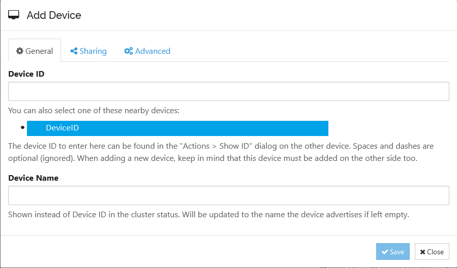

# Sync tools
## [Syncthing](https://syncthing.net/)
*(open source, no 3rd parties)*

**Windows (install & setup)**
1.  Download and unzip folder with app
2.  App starts at http://localhost:8384/ (admin panel)
3.  Set your password for admin panel access
4.  Set default folder if needed
5.  To start sharing data another device should be added. Use button "Add Remote Device" to add new device.
	
	Select or insert second deviceId and specify sync folder in "Sharing" tab
6.  Open Syncthing admin panel on another device and **wait** for add request and accept it.
7.  The easiest way to set autorun for Syncthing on Windows is to create new Shortcut in Startup folder with following parameters:
    `"[yourpath]\syncthing.exe" -no-console -no-browser`
    *(to get to startup folder press Win + R, type shell:startup, Enter)*

**Linux**
- Install:  Download using package manager or flatpak
(e.g. `sudo apt install syncthing` or `flatpak install syncthing`)
- Autorun: Enable auto load using systemd
`systemctl --user enable syncthing.service`
`systemctl --user start syncthing.service`

**MacOS**
- Install: Install using homebrew cask
    `brew install --cask syncthing`
- Autorun: Just open the app in *Applications* and follow instructions

**Useful links:**
- https://docs.syncthing.net/users/autostart.html